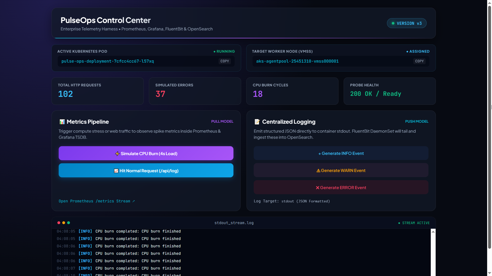
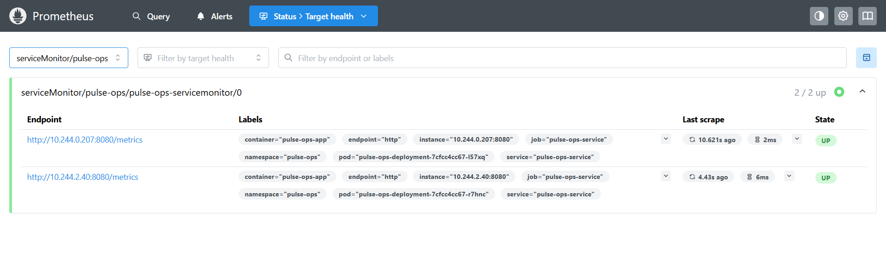
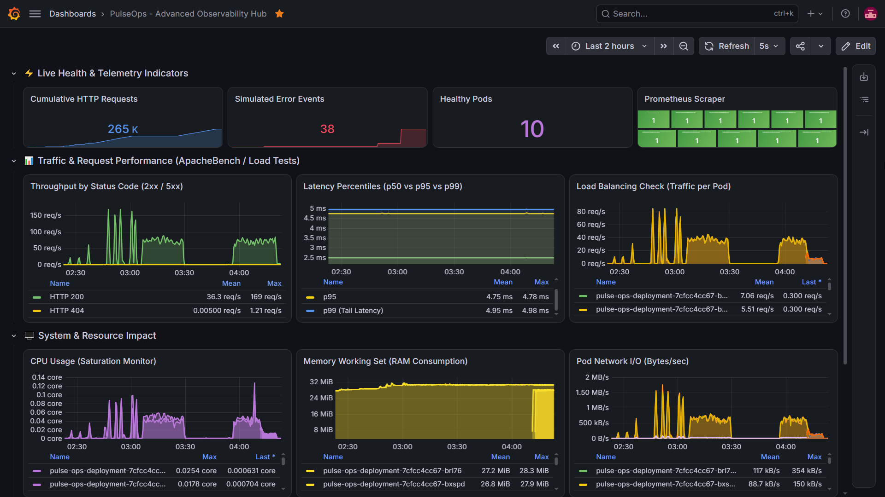
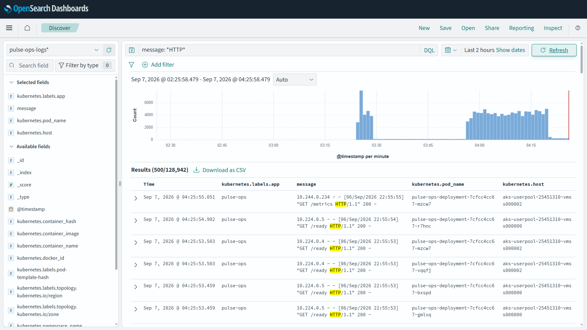
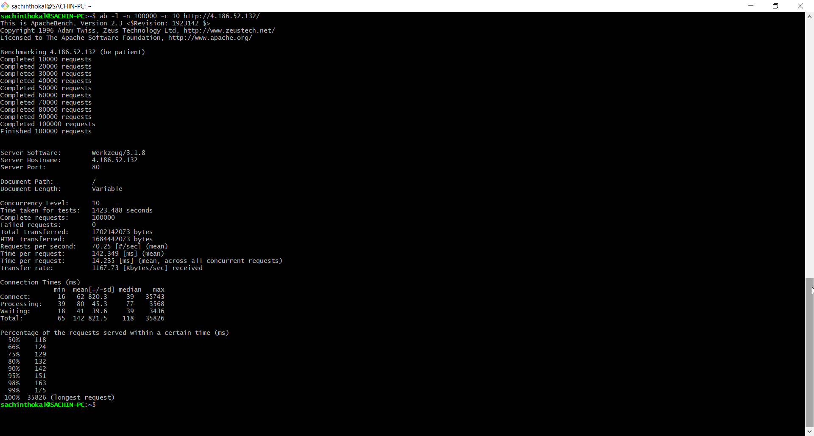

# Pulse-Ops: Enterprise Observability & Centralized Logging on AKS

Production-grade observability and distributed logging platform deployed on Azure Kubernetes Service (AKS). The system instruments a dual-replica microservice (`pulse-ops`) behind an Azure Load Balancer, capturing real-time metrics with Prometheus/Grafana and centralizing containerd CRI logs with FluentBit/OpenSearch.

The architecture was validated under a continuous 24-minute stress benchmark of **100,000 HTTP requests** at concurrency 10, maintaining a **0.00% error rate** and a **175 ms p99 tail latency**.

---

## 🖥️ Live Telemetry & Control Center

The application provides embedded runtime telemetry hooks to trigger compute load, inject simulated warnings/errors, and test Kubernetes readiness probes.

<p align="center">
  
</p>

---

## 🏗️ Architecture Flow

```text
                           [ Azure Standard Load Balancer ]
                                          │
                     ┌────────────────────┴────────────────────┐
                     ▼                                         ▼
         [ pulse-ops Pod: Replica 1 ]              [ pulse-ops Pod: Replica 2 ]
           │                      │                  │                      │
    (:8080/metrics)         (stdout/stderr)   (:8080/metrics)         (stdout/stderr)
           │                      │                  │                      │
           ▼                      │                  ▼                      │
  [ Prometheus Scraper ]          │         [ Prometheus Scraper ]          │
           │                      │                  │                      │
           ▼                      │                  ▼                      │
  [ Grafana Dashboards ]          │         [ Grafana Dashboards ]          │
                                  └──────────────────┬──────────────────────┘
                                                     ▼
                                          [ FluentBit DaemonSet ]
                                           (containerd CRI Parser)
                                                     │
                                                     ▼
                                         [ OpenSearch Cluster:9200 ]
                                          (pulse-ops-logs* Index)
                                                     │
                                                     ▼
                                         [ OpenSearch Dashboards ]

```

### Component Breakdown

| Layer | Technology | Operational Function |
| --- | --- | --- |
| **Cluster Orchestration** | Azure Kubernetes Service (AKS) | Multi-node worker pools hosting production and monitoring workloads. |
| **Workload** | Python / Flask (`pulse-ops`) | Exposes application metrics (`/metrics`) and streams structured JSON logs to container stdout. |
| **Ingress & Traffic Split** | Azure Standard Load Balancer | Distributes Layer 4 incoming traffic equally across active application pods. |
| **Metrics Pipeline** | Prometheus Operator | Discovers pod endpoints dynamically via `ServiceMonitor` every 15s. |
| **Metrics Visualization** | Grafana | Custom telemetry dashboard tracking RPS, p50/p95/p99 latency, and saturation. |
| **Log Collector** | FluentBit (DaemonSet) | Mounts `/var/log/containers`, parses containerd CRI streams, and enriches logs with Kubernetes metadata. |
| **Log Datastore** | OpenSearch | Single-node log indexing engine optimized with security plugins disabled for lab throughput. |
| **Log Analytics UI** | OpenSearch Dashboards | Real-time discovery, field filtering, and histogram visualization of application events. |

---

## 📊 Metrics Pipeline Verification (Prometheus & Grafana)

### 1. Prometheus Scraper Target Health

The Prometheus Operator monitors pod instances dynamically through `ServiceMonitor` resources, maintaining dual-target availability.

### 2. Grafana Advanced Observability Hub

Real-time dashboard capturing overall health, traffic split across pods, latency distribution, and CPU/memory footprints.

* **Traffic Split:** Incoming traffic maintained an equal 50/50 distribution across both pod replicas (~35 req/s per replica).
* **Resource Stability:** Memory consumption remained flat at 27-28 MiB per pod throughout the 24-minute stress run, confirming zero memory leaks. Peak CPU stayed capped below 0.12 cores per container.
* **Error Rate:** 0% 5xx errors recorded; cumulative request counter climbed past 265,000+.

---

## 🔍 Centralized Logging Pipeline (FluentBit & OpenSearch)

FluentBit ingests raw container logs from `/var/log/containers/*pulse-ops*.log`, parses CRI output strings, attaches pod/node metadata, and pushes structured documents into OpenSearch.

### Noise Isolation Query (DQL)

To filter out Prometheus scraping (`/metrics`) and Kubernetes readiness probes (`/ready`) while inspecting application traffic:

```text
message: *HTTP* and not message: *metrics* and not message: *ready*

```

---

## ⚡ 100,000-Request Stress Test Benchmark

A sustained benchmark using ApacheBench (`ab`) validated cluster reliability, load balancing accuracy, and observability correlation under load.

```bash
ab -l -n 100000 -c 10 http://<EXTERNAL-IP>/

```

### Benchmark Results

| Parameter | Observed Value | Production Impact |
| --- | --- | --- |
| **Total Completed Requests** | **100,000** | Full run completed without dropped connections. |
| **Failed Requests** | **0** | **0.00% Error Rate** across 24 minutes of continuous traffic. |
| **Total Test Duration** | **1,423.488 seconds (~23.7 min)** | Sustained endurance run verifying resource stability. |
| **Throughput (Sustained)** | **70.25 req/sec** | Stable request processing rate under concurrent load. |
| **Data Transferred** | **1.70 GB** (1,702,142,073 bytes) | High-volume payload delivery via Azure Load Balancer. |
| **Network Transfer Rate** | **1,167.73 KB/sec** | Sustained network egress throughput. |
| **Median Latency (p50)** | **118 ms** | 50% of requests served in under 120 ms. |
| **P95 Latency** | **151 ms** | 95% of requests served in under 155 ms. |
| **P99 Tail Latency** | **175 ms** | 99,000 requests served in under 175 ms. |

---

## 🛠️ Helm & Pipeline Configurations

### 1. FluentBit (`k8s/fluent-bit-values.yaml`)

Configured to use the `cri` parser to prevent log drops on containerd-based AKS nodes.

```yaml
config:
  service: |
    [SERVICE]
        Flush         1
        Log_Level     info
        Daemon        off
        Parsers_File  parsers.conf
        HTTP_Server   On
        HTTP_Port     2020

  inputs: |
    [INPUT]
        Name              tail
        Tag               kube.*
        Path              /var/log/containers/*pulse-ops*.log
        Parser            cri
        DB                /var/log/flb_kube.db
        Mem_Buf_Limit     5MB
        Skip_Long_Lines   On

  filters: |
    [FILTER]
        Name                kubernetes
        Match               kube.*
        Kube_URL            [https://kubernetes.default.svc:443](https://kubernetes.default.svc:443)
        Merge_Log           On
        Merge_Log_Key       log_processed
        Keep_Log            Off
        K8S-Logging.Parser  On
        K8S-Logging.Exclude On

  outputs: |
    [OUTPUT]
        Name            opensearch
        Match           kube.*
        Host            opensearch-cluster-master
        Port            9200
        Index           pulse-ops-logs
        Type            _doc
        tls             Off
        tls.verify      Off
        Suppress_Type_Name On

```

### 2. OpenSearch Dashboards (`k8s/dashboards-values.yaml`)

Allocates memory limits (1536Mi) to avoid NodeJS cold-start timeouts and disables UI security modules for direct lab access.

```yaml
opensearchHosts: "http://opensearch-cluster-master:9200"

resources:
  requests:
    cpu: "300m"
    memory: "768Mi"
  limits:
    cpu: "1000m"
    memory: "1536Mi"

config:
  opensearch_dashboards.yml: |
    server.host: "0.0.0.0"
    opensearch.hosts: ["http://opensearch-cluster-master:9200"]
    opensearch.ssl.verificationMode: none

opensearchAccount:
  security:
    disabled: true

extraEnvs:
  - name: DISABLE_SECURITY_DASHBOARDS_PLUGIN
    value: "true"

startupProbe:
  tcpSocket:
    port: 5601
  initialDelaySeconds: 20
  periodSeconds: 10
  failureThreshold: 30

```

---

## 🚀 Deployment Guide

### 1. Deploy the Application

```bash
kubectl apply -f k8s/pulse-ops-deployment.yaml
kubectl apply -f k8s/pulse-ops-service.yaml

```

### 2. Deploy Prometheus & Grafana

```bash
helm repo add prometheus-community [https://prometheus-community.github.io/helm-charts](https://prometheus-community.github.io/helm-charts)
helm repo update

helm install monitoring prometheus-community/kube-prometheus-stack \
  --namespace monitoring --create-namespace

```

### 3. Deploy OpenSearch & Dashboards

```bash
helm repo add opensearch [https://opensearch-project.github.io/helm-charts](https://opensearch-project.github.io/helm-charts)
helm repo update

helm install opensearch-cluster opensearch/opensearch \
  --namespace logging --create-namespace \
  --set singleNode=true \
  --set config."plugins\.security\.disabled"=true

helm install opensearch-dashboards opensearch/opensearch-dashboards \
  --namespace logging \
  -f k8s/dashboards-values.yaml

```

### 4. Deploy FluentBit DaemonSet

```bash
helm repo add fluent [https://fluent.github.io/helm-charts](https://fluent.github.io/helm-charts)
helm repo update

helm install fluent-bit fluent/fluent-bit \
  --namespace logging \
  -f k8s/fluent-bit-values.yaml

```

---

## 🧹 Resource Teardown

To release cloud resources and prevent ongoing billing:

```bash
# Uninstall logging and monitoring Helm releases
helm uninstall fluent-bit -n logging
helm uninstall opensearch-dashboards -n logging
helm uninstall opensearch-cluster -n logging
helm uninstall monitoring -n monitoring

# Delete application resources
kubectl delete -f k8s/pulse-ops-service.yaml
kubectl delete -f k8s/pulse-ops-deployment.yaml

# Clean up namespaces
kubectl delete namespace logging monitoring

```
---

---

## 📸 System Telemetry & Visual Showcase

### 1. Prometheus Target Scraping (ServiceMonitor Health)
<p align="center">
  
</p>

### 2. Grafana Telemetry Dashboard (Throughput, Latency & Load Balancing)
<p align="center">
  
</p>

### 3. OpenSearch Dashboards (Real-Time Container Log Analytics)
<p align="center">
  
</p>

### 4. ApacheBench 100k Stress Test Execution (0% Drop / Sub-200ms)
<p align="center">
  
</p>

---